# Lab 1: Graphing Data

<script>
$("#coverpic").hide();
</script>

<span class="newthought">
Whoops
---Edward Tufte
</span>

As we have found out from the textbook and lecture, when we measure things, we get lots of numbers. Too many. Sometimes so many your head explodes just thinking about them. One of **the most helpful things** you can do to begin to make sense of these numbers, is to look at them in graphical form. Unfortunately, for sight-impaired individuals, graphical summary of data is much more well-developed than other forms of summarizing data for our human senses. Some researchers are developing auditory versions of visual graphs, a process called **sonification**, but we aren't prepared to demonstrate that here. Instead, we will make charts, and plots, and things to look at, rather than the numbers themselves, mainly because these are tools that are easiest to get our hands on, they are the most developed, and they work really well for visual summary. If time permits, at some point I would like to come back here and do the same things with sonification. I think that would be really, really cool!

## General Goals

Our general goals for this first lab are to get your feet wet, so to speak. We'll do these things:

1. Load in some data to a statistical software program
2. Talk a little bit about how the data is structured
3. Make graphs of the data so we can look at it and make sense of it.

### Important info

1. Data for NYC film permits was obtained from the NYC open data website. The .csv file can be found here: <a href="https://raw.githubusercontent.com/CrumpLab/statisticsLab/master/data/Film_Permits.csv" download>Film_Permits.csv</a>


2. Gapminder data from the gapminder project (copied from the R gapminder library) can be downloaded in .csv format here: <a href="https://raw.githubusercontent.com/CrumpLab/statisticsLab/master/data/gapminder.csv" download>gapminder.csv</a>


## Excel
Have you ever gotten home (or to Brooklyn college) to find orange cones preventing you from parking because yet another film shoot has been issued a permit to take up the entire block with trucks and trailers? Today we are going to take a look at some data collected by the New York City government, about filming permits issued in the last several years. 

### Goals

Today I will walk you through techniques to make several different types of graphs in excel, that will help us quickly visually summarize a large set of data. You will learn to:

* Count occurrences of variables in cells
* Make bar graphs of this data
* Construct a histogram using the data analysis tool pack
* Write a brief interpretation of our findings

The data we will look at today contains 14 different variables of information about 50728 different film permits issued by the city in the last several years. That is **a lot** of data, and can be pretty intimidating at first glance. Trying to wrap our heads around any meaning of patterns in this data seems like a daunting task. This is why statistics and graphs are awesome. Statistics and graphs are short cuts that help complicated trends and patterns hidden in large sets of numbers become obvious to the human eye / brain. Before we get started, let's load up the data, and you can see what I mean.

### Load the data

1) Download the data as a .csv file from section 1.3 above (INSERTLINK 1.3)
2) Open the downloaded file in excel
3) Save the file as an Excel document
 
 > File &rightarrow; Save As...  
 > filetype: .xlsx  
 > name:     personalize the file name so you will recognize this as your own copy of the data  (maybe: Lab1_YourName)
 
 
<iframe width="560" height="315" src="https://www.youtube.com/embed/BwfCAIix-JM" frameborder="0" allow="autoplay; encrypted-media" allowfullscreen></iframe>


### Inspect the data

When you open the Excel file, you will see many rows and columns of data. Each row (except row 1) contains data corresponding to one filming permit (what we might think of as a "subject" in this case). Row 1 however, contains the names of each variable, which we call the "Header" row. Each column contains data for a single variable, for every subject. Using the bar on the right edge of your screen, scroll through the data a bit and take a look. 

I'll wait....

Did you find anything cool in there? Notice any patterns about where, when, how long film permits are issued for?

No! Of course you didn't! Right now our data is just a giant mess of numbers! Way too many numbers!!!

This is the fundamental reason why graphs and statistics are awesome. We are going to distill meaning that is easily and quickly identifiable out of this hot mess of numbers. 

Our analysis goals for this walkthrough are:

1) Create a bar graph that displays the number of permits issued in each borough.
2) Create a bar graph that displays the number of each type of permit issued in Brooklyn.
3) Create a histogram that displays the lengths of time that these permits are valid for. 

### Preparing the data

#### Creating blank worksheets

First, we will create a blank worksheet for each of the graphs we will be producing today. 

1) Click the "+" button on the worksheet tab bar to create a new worksheet
2) Right click on the new worksheets tab and select "rename"
3) Give the sheet a meaningful name, maybe "BarGraph - Borough" 
4) Repeat steps 1-3 until you have 3 blank worksheets, one for each graph. Rename each one with a sensible name

<iframe width="560" height="315" src="https://www.youtube.com/embed/uZ_wOLMyV3I" frameborder="0" allow="autoplay; encrypted-media" allowfullscreen></iframe>
 
#### Create a working copy of the data

We will now copy to each of these sheets *just* the data we will need to complete each graph. In Excel, there are often many paths to the correct answer/graph/statistic. The method I am about to show you is very clean and organized, but as you get more experience with excel, you might find ways to take shortcuts and skip some of these steps

For each of our 3 graphs, and 3 corresponding worksheets, we will need different variables:

Graph | Variables needed
------|-----------------
Bar graph by Borough | Borough
Bar graph by type, Brooklyn only |Borough and Category
Histogram of permit duration | StartDateTime and EndDateTime

1) Go to the worksheet named "Film_Permits" that contains the original data by clicking its' name on the worksheet tab bar (near the bottom of your screen)
2) click on the letter "H" above the column named "Borough". This will select the entire column of data
3) Press ctrl+c to copy this data to the clipboard (or right click the data you selected and then click "copy")
4) Go to the worksheet where you will create the first bar graph.
5) Click cell "A1"
6) Press ctrl+v to paste this data from the clipboard (or right click "the data you selected "A1" and then click "paste")

Repeat this process until all three of your new worksheets contain the variables mentioned in the table above. 

<iframe width="560" height="315" src="https://www.youtube.com/embed/BQEwLANUCsA" frameborder="0" allow="autoplay; encrypted-media" allowfullscreen></iframe>

### Bar graph by borough 

The first graph we create will be a bar graph. The (horizontal) x-axis of this graph will display each of the five boroughs. The vertical) y-axis of this graph will display the frequency, or number, of film permits issued per borough. 

#### Calculate Values to graph

First click the tab of the worksheet where you placed only the "Borough variable" to make that sheet active.

In order to generate this graph, we first need to calculate how many permits were issued in each of the five boroughs. 

1) Starting in column C, Row 1, (as in Cell C1), write the name of one of the 5 boroughs. Let's start with "Brooklyn", because. 
2) In the cell to the right of C1, aka D1, write "Bronx". 
3) Keep going to the right, and write the labels "Queens", "Manhattan", and "Staten Island"
4) In cell C2, write or copy/paste the formula:

> =COUNTIF(A:A,C1)

5) Press enter.

You should now see that the cell C2 now displays 15389. This is the total number of film permits issued in Brooklyn over the past several years. The "CountIf" function takes two inputs, separated by a comma. The first input tells the function "**Where** should I count stuff?" and the second input tells the function "**What** should I count there?". 

So "=COUNTIF(A:A,C1)" translates to "Search through the whole A column **(A:A)**, and **count** each cell **if** it equals whatever is in cell **C1** (Brooklyn)". 

The help files inside excel are pretty great at explaining how different functions work. you can quickly access the help file on any function by type it into a cell and clicking its name. See the video below.

<iframe width="560" height="315" src="https://www.youtube.com/embed/2NVXYY-eBPU" frameborder="0" allow="autoplay; encrypted-media" allowfullscreen></iframe>

6) Repeat this process to under each of the four other borough labels. 

You should end up with:

 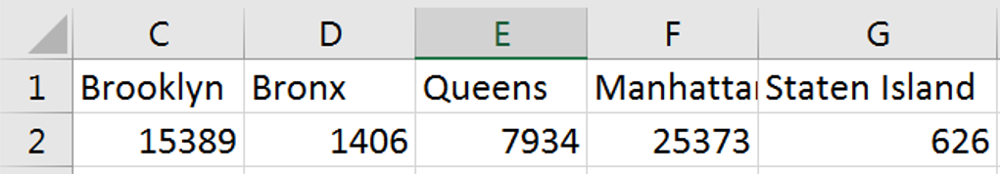 
 

#### Create and customize the graph

Now that we have our data, we can go about making our graph.

1) Press down the left mouse button on C1 (where it says "Brooklyn") and hold drag your mouse to the right until you have highlighted all five borough names, and down until you have selected both the labels and the data. 
2) Release the mouse button (I'm so glad I remembered to include this step. You could have ended up holding the mouse button down forever!).
2) Click the "Insert" button on the menu ribbon near the top of your screen
3) Click the "column chart" button to insert a column chart. 

<iframe width="560" height="315" src="https://www.youtube.com/embed/OQ2wZl4xwaI" frameborder="0" allow="autoplay; encrypted-media" allowfullscreen></iframe>

And there we go! 'We have a bar graph!

Now let's play with some of the graphs options to make it look a little more presentable. 

1) Select your graph
2) Click the "Design" button on the menu ribbon
3) Click "add chart element". From this menu you can add and remove features from your graph. 
4) Click "Axis labels" to add labels to both your vertical and horizontal axes. 
5) Now your graph will have the words "Axis title" along both the bottom and left edge.
6) Click into these text boxes and give the axis a sensible label (maybe "Film Permits" and "Borough")

Play with the other settings and options in the design ribbon. There are a lot of options on how to present a graph. The most important thing to remember is that a graph should be as easy to read as possible. Try not to include things that are redundant, or don't add to the point you are trying to make.

On other words, this:

 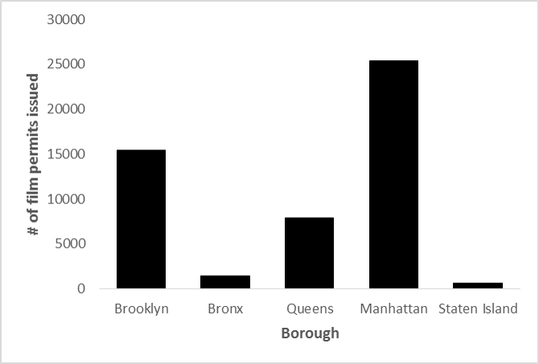 

Not this:


 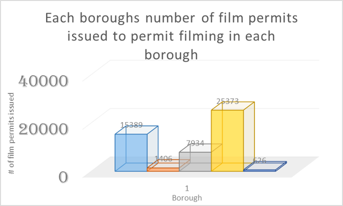 

### Bar graph by type, Brooklyn only

Now we are going to make a similar graph, but this time we are going to look at the types of permits being issued, but only in Brooklyn (leaving the other lesser boroughs out of it for now). 

Because we only want to count each category in only one borough, we are going to have to use the =COUNTIFS function this time around.


#### Calculate Values to graph

1) Click the second worksheet we created before, the one that we pasted the Borough and Category variables to. 
2) Create a label for each type of category, starting in cell D1 and moving to the right.
(Commercial, Film, Still, Photography, Student, Television, Theater, WEB)

3) Write "Brooklyn" in cell C1
4) in Cell D2, write the function:

> =COUNTIFS(A:A,C1,B:B,D1)

<iframe width="560" height="315" src="https://www.youtube.com/embed/h55GOmowSw8" frameborder="0" allow="autoplay; encrypted-media" allowfullscreen></iframe>

Countifs will only count rows that meet all of its' criteria. 

Its usage is =countifs(where to count 1 , what to count 1, where to count 2, what to count 2 ). 

The function we just entered translates to: *Search through the borough variable (column A) and count all the rows that say "Brooklyn" (C1), then search through those rows in the category variable (column B), and count all the ones that say "Commercial" (D1)*

Remember to check out the excel help on countifs.

5) Repeat this function for each of the other category labels (Television, etc.)

your result should look like this:

 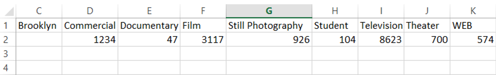 

#### Create and customize graph

1) Highlight the data we just calculated
2) Click the "Insert" button on the menu ribbon near the top of your screen
3) Click the "column chart" button to insert a column chart. 

Give it axis labels, and make any other design changes you think make the graph easier to read.

### Histogram of permit duration

We will now make a histogram of the duration of each of these permits. A histogram is a lot like a bar graph, except histograms are used for continuous variables (like length of time), and bar graphs are used for categorical variables (like borough or category). The biggest visual difference is that the bars in a bar graph have space between them, while a histograms bars touch each other. 

#### Install the data analysis toolbox

We will use the data analysis toolbox to construct this graph. The data analysis toolbox is a free add on for Microsoft excel. Most university computers will already have this installed. To check if the data analysis toolbox is installed:

1) Click "data" in the menu ribbon
2) if the data tab contains a section called "analysis", and a "data analysis" button, then the toolbox is installed, and you can proceed, if not follow these [instructions](https://support.office.com/en-us/article/load-the-analysis-toolpak-in-excel-6a63e598-cd6d-42e3-9317-6b40ba1a66b4) to install the toolbox.

#### Calculate Values to graph

1) Click the third worksheet we created before, the one that we pasted the Start Date and End Date variables to.
2) In cell C2, to the right of the first start/end date pair, type the formula:

>=B2-A2

Subtracting the start data from the end date will give us the number of days the permit was issued for. a value of ".25" means that the permit was valid for 6 hours (.25 * 24 hours in a day)

Now we need to copy paste the formula into column C next to each row of data. But since this data set holds over 50,000 rows, selecting all of that data manually would be tedious. I'm going to use so keyboard shortcuts here, that make it ver easy to move around large sets of data in excel. 

1) Start by click the cell we want to copy (C2, where we put the subtraction formula)
2) press ctrl+c to copy that formula. 
3) Press the left arrow once to move to cell B2
4) Hold the ctrl button and press the down arrow. This will "jump" the cursor down to the end of the data. When you hold ctrl, arrow keys move the cursor to the last piece of data in that row or column, before a blank cell.
4) Now release the ctrl button, and press the right arrow once, moving the highlighted cell to C50729.
5) Hold ctrl+shift+up arrow. This makes the cursor jump back up to our formula, and holding shift make it highlight all cells between the start and end of the jump
6) press ctrl+V to paste our formula in the cells we just selected. 

<iframe width="560" height="315" src="https://www.youtube.com/embed/ei4e5_IGScg" frameborder="0" allow="autoplay; encrypted-media" allowfullscreen></iframe>

Learning to use the arrow keys, ctrl, and shift to move around and highlight data in Excel can turn a 2 hour analysis into a 20 minute analysis, and is a great skill to practice. An Excel champion very rarely needs to touch their mouse. 


#### Create and customize graph

##### Create bin labels

Now that we have the duration of each permit, we can start to put it together for use in a histogram. In order to do this, we will need to define the "bins" (x-axis units) of our histogram. 

1) In cell E2 type the number "0"
2) Now in the cell below 0, write the formula

> = E2+.1

3) Copy this formula in the spaces below, until the final result = 3 (days)

<iframe width="560" height="315" src="https://www.youtube.com/embed/Vq3x3E-iJa4" frameborder="0" allow="autoplay; encrypted-media" allowfullscreen></iframe>

##### Data analysis toolbox - Histogram
1) Click the "data" button in the menu ribbon
2) Click the "data analysis" button
3) Select the "histogram" option
4) Next to "input range", click the cell selection button [](img/1-4.png) 
5) Using the mouse, click the label "C" at the top of the column containing the permit duration values. 
6) Press enter
7) Next to "Bin Range", click the cell selection button [](img/1-4.png) 
8) Using the mouse, highlight the bin values we created in step 3.
9) Press enter
10) Make sure the check mark next to "Chart output" is selected
11) In the output section, select "New Worksheet" and enter a name (maybe "Permit Duration - Histogram")
12) Press enter

<iframe width="560" height="315" src="https://www.youtube.com/embed/F5piCdhQS8U" frameborder="0" allow="autoplay; encrypted-media" allowfullscreen></iframe>

Excel will now create a new worksheet that has a frequency table, using the bins we provided, and a histogram of that data. We could have created this chart the hard way, using a =COUNTIF function, but the data analysis toolbox did a lot of the work for us in this example. 

Now you can edit the visual appearance of the graph. At the very least, we need to make all the bars touch one another, to make it clear to that this is a histogram and not a bar graph. 

1) Right click on one of the bars of the graph and select "Format data series"
2) In the window that appears, set "gap width" to 0

<iframe width="560" height="315" src="https://www.youtube.com/embed/Vab5SW3aPHc" frameborder="0" allow="autoplay; encrypted-media" allowfullscreen></iframe>

### Reporting and interpreting our results

 
 
Figure 1 shows the number of film permits issued in each of the last 5 boroughs over the last several years. From this graph we can see that in Manhattan and Brooklyn, over 15000 permits have been issued over this period. Queens has also had a high number of permits issued, Whilre very few permits have been issued in the Bronx and Staten Island.
 
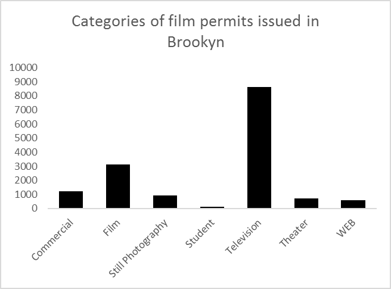 
  
Figure 2 shows the number of film permits issued in Brooklyn, broken down by category of permit. Here we can see that the vast majority of filming that goes on in Brooklyn is for television projects, with film projects a distant second.   
  
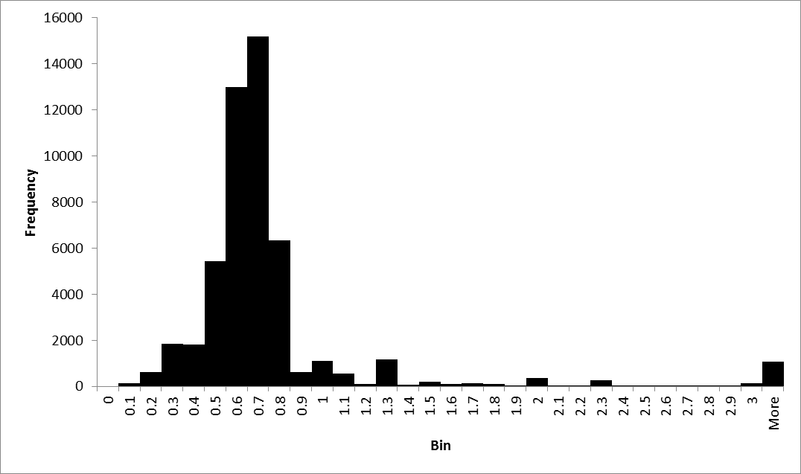 
 
 Figure 3 is a histogram of the duration of time that film permits issued in NYC are valid for between .6 and .7 days. This number makes sense, as that is the approximate length of an average working day. The data set contains ~ 1000 outliers, which are permits in the "more than 3 days" category. 
 

### On Your Own

1) Create a bar graph that shows the frequency of each category of film permit across all five boroughs.

2) Create 4 more bar graphs of the frequency of each category of film permit in each of the other four borough (beside the one we already made for Brooklyn)

3) Create a histogram of the time between the date a permit was entered into the NYC system (EnteredOn) and the start date of the permit (StartDateTime)

4) In one to two pages, discuss what you see in these graphs, and what you can learn about film permits in NYC with all the graphs you made today. Be sure to label each graph, and make specific references in your text to each of the graphs, explaining how/what that graph has to say. 


## SPSS


In this lab, we will get you acquainted with the SPSS software layout and graph some sample data to make sense of it. We will be doing the following:

1. Opening SPSS and the SPSS layout 
2. Reviewing variable properties and the Variable View tab
3. Opening a data file and producing different types of graphs

### Opening SPSS and the SPSS layout

---

Your lab instructor will take you through the process of opening the SPSS program. You may double-click on its icon located on the desktop of your lab computer, or you may find it using the Start menu. Once the program loads,  you will be prompted with a pop-up window that asks you which file you would like to open. For now, we will be examining the basic layout of SPSS without a data set, so you can click <span style="color:blue">Cancel</span>. 

Once you do, the main SPSS spreadsheet should open. It will look like this, a basic spreadsheet:

```{r , fig.cap="Empty SPSS spreadsheet", echo=FALSE,dev='png'}
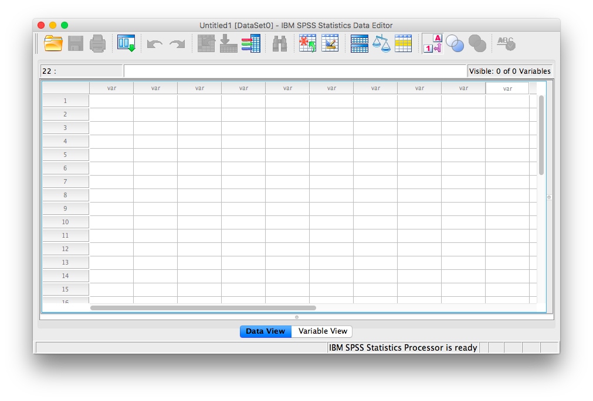
```
Notice at the bottom of your window there are two tabs; "Data View" and "Variable View". In data view, we enter data into our spreadsheet. You will notice that rows are numbered on the left-hand side of the spreadsheet, while columns are labeled "var". This is an indication of the general structure of SPSS: Variables are contained in the columns, and rows indicate individual observations.  For example, if you obtained the heights (in inches) of 5 people {x= 64, 70, 63, 62, 65} and wanted to enter their data into SPSS, each person's height would be entered in a new row, not across the columns, as seen below:


```{r , echo=FALSE,dev='png'}
knitr::include_graphics('img/1.4.12.png')
```

### Reviewing variable properties and the Variable View tab

---

Now that we have some data entered, we might want to name our variable so that it's evident our measurements represent heights. In order o view or modify variable names and other properties, look to the bottom of your SPSS window and switch over to the "Data View" tab. Once you do this, your window will appear as follows:


```{r , echo=FALSE,dev='png'}
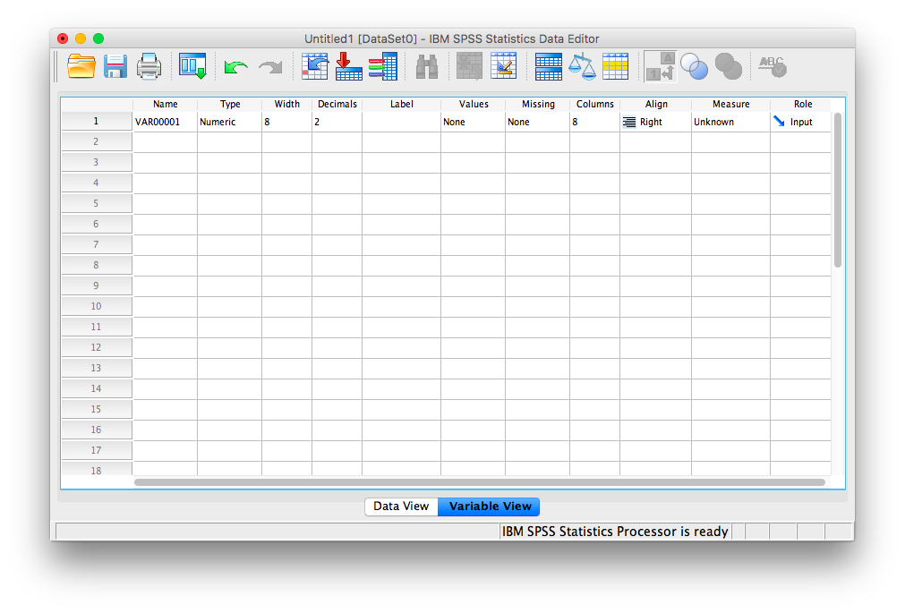
```

Here, you can edit the name of your variables, and specify their properties. Variable names can be anything you like, with the restriction that you cannot use numbers or spaces. Next, notice several other important properties of variables you may at some point need to set or modify:

+ Name: the name of your variable that will appear as a colum header in Data View. No spaces or numerals.
+ Type: Your data will most often be Numeric, but sometimes, as in data representing currency or data in scientific notation, you may change the data type appropriately. If your data is simply a label, word, or response (such as an open-ended response to a survey question), choose "String": this tells SPSS not to treat this variable as a number. (Nota bene: if you select the wrong type of variable, SPSS may not be able to process your requested calculations, so always remember to check this parameter!)
+ Width: This refers to how many digits will be visible by default.
+ Decimals: This refers to how many decimal places will be visible by default.
+ Label: This is a description of the variable. Any information too long to be included in the variable name goes here.
+ Values: For nominal scale data, let's say 1 represents male and 2 represents female, this is where you include the values and their corresponding labels. 
+ Measure: This variable property allows you to specify the nature of your data. Depending on the kind of scale you are using, you will choose a different measure type. Nominal and ordinal are chosen for nominal and ordinal scales, respectively. "Scale" is used when your data is measured on a ratio or interval scale. (Nota bene: this "Measure" designation is only a marker; it does not affect the calculations as in the "Type" parameter. Even if you choose the wrong icon/label for "Measure", SPSS will still produce the correct output)

### Opening a data file and producing different types of graphs

---


Now that we know about the properties of the SPSS spreadsheet window, let's open a data file and learn how to make some sense of it by creating different types of graphs. [Here](https://github.com/CrumpLab/statisticsLab/blob/master/data/spssdata/nyc_films.sav) is a link to an SPSS-based data file containing information about film permits (requests made by film companies to shoot TV shows and movies on location) filed in New York City. The file is named nyc_films.sav.

Once you open the data file, browse through to familiarize yourself with the variables that are being measured. Switch over to Variable View for details of each variable. 

#### Bar Graphs

---


Now, back to Data View. We will not be working with every single variable in this spreadsheet, but we'll select a few interesting ones with which to answer questions. Let's start with `borough`. Suppose we wanted to know which borough receives the most film permits (you can probably guess which one is most popular). Let's use SPSS to produce a graph to answer this question. With your data file open, go up to the top menu and choose <span style="color:blue">Graphs</span>, then <span style="color:blue">Legacy Dialogs</span>. You will see an entire list of possible graphs we can use to plot our data. 

Let's think about the nature of our question: we would like to know how many permits were filed for each borough. Borough is simply a label or a name for a region, and we want to know the frequency of permits for each borough. This is a nominal scale variable and so, we will appropriately choose a BAR graph to plot it. Select <span style="color:blue">Bar...</span>

```{r , echo=FALSE,dev='png'}
knitr::include_graphics('img/1.4.14.png')
```

The next window will ask you to specify what kind of graph you would like. Select <span style="color:blue">Simple</span> and then <span style="color:blue">Define</span>. 
```{r , echo=FALSE,dev='png'}
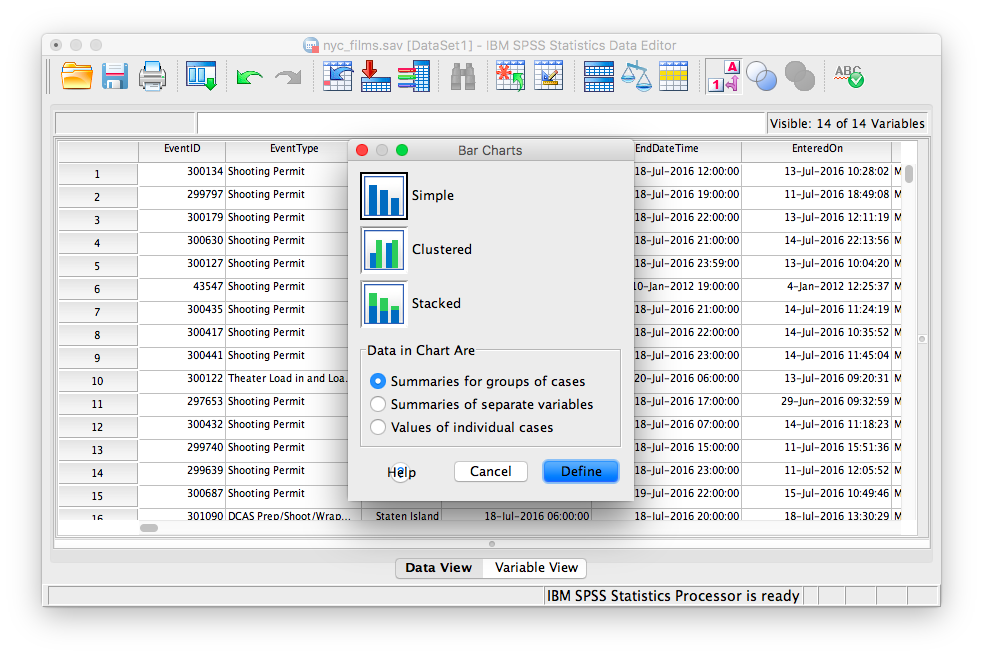
```
The following window will ask which variable you'd like to plot. Select `borough` from the left-hand list and use the arrow to move it into the field labeled "Category Axis". Then click <span style="color:blue">OK</span>. 

```{r , echo=FALSE,dev='png'}
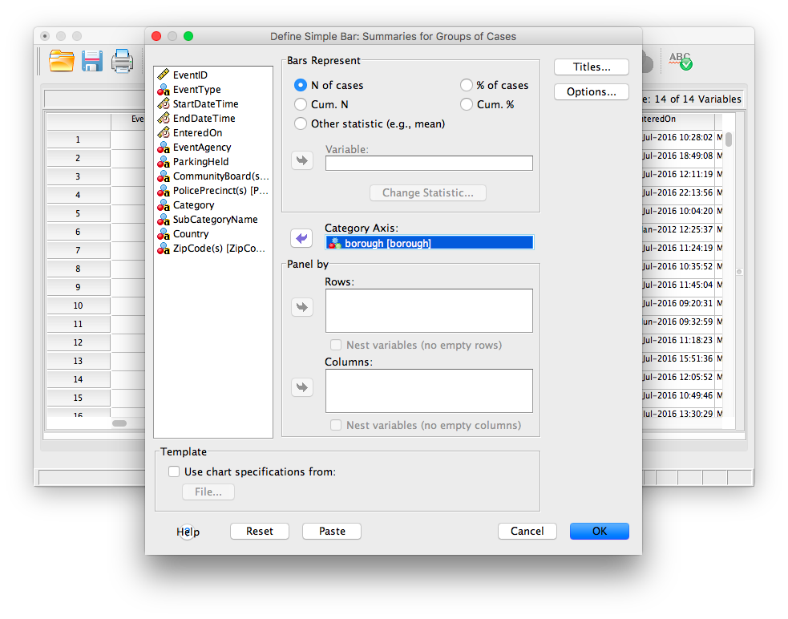
```

SPSS will produce a new output window which will contain the bar graph you have generated. Notice which borough receives the most film permits. Are you surprised?

```{r , echo=FALSE,dev='png'}
knitr::include_graphics('img/1.4.17.png')
```

#### Histograms

---


Now, let's use a different data set to plot a histogram. The defining difference between a histogram and a bar graph (although they look very similar as they both utilize bars) is that a histogram is used to display a continuous variable (interval or ratio scale). In the previous example, boroughs were simply labels or names, so we used a nominal scale and therefore a bar graph. Here, we will deal with life expectancy (measured in years), an interval scale measure. [Here](https://github.com/CrumpLab/statisticsLab/blob/master/data/spssdata/life_expectancy.sav) is a link to the SPSS data file, life_expectancy.sav. Open this file and examine its rows and columns. Each column represents a year during which life expectancy was measured. Each row represents a different country. 

Let's first get an idea about life expectancy in general. We want to plot a histogram with life expectancy on the x-axis and frequency on the y-axis. Choose <span style="color:blue">Graphs</span> in the top menu, then <span style="color:blue">Legacy Dialogs</span>. From here, remember we want a histogram, not a bar graph, so let's select <span style="color:blue">Histogram...</span>. 

```{r , echo=FALSE,dev='png'}
knitr::include_graphics('img/1.4.18.png')
```

The window that appears contains every variable in your spreadsheet listed on the left-hand side. We can choose one variable at a time to plot. Let's scroll all the way down the list and choose `2017 [v219]`. This is the variable containing life expectancies for the year 2017. Using the arrow, move that variable into the field labeled "Variable:", then click <span style="color:blue">OK</span>.

```{r , echo=FALSE,dev='png'}
knitr::include_graphics('img/1.4.19.png')
```

SPSS will produce an output window containing the distribution of life expectancy for the year 2017.

```{r , echo=FALSE,dev='png'}
knitr::include_graphics('img/1.4.20.png')
```

#### Scatterplots

---


Now, we will look to a different type of data plot; the scatterplot. A scatterplot allows us to visualize bivariate data, that is, data for which there are two measurements per individual. For example, we may ask whether life expectancy in a country (or how long you live, on average) is related to the average income. Using the life_expectancy.sav data file, let's plot both variables: `2017 [v219]` and `income`. The income variable in the spreadsheet refers to data collected in 2017 by the Better Life Initiative. Notice not all the countries listed have estimates for average annual income. For those that do, this value represents household net adjusted income (annual) in US dollars. 

To create the scatterplot, let's go to <span style="color:blue">Graphs</span> in the menu toolbar, then <span style="color:blue">Legacy Dialogs</span>, then <span style="color:blue">Scatter</span>. 

```{r , echo=FALSE,dev='png'}
knitr::include_graphics('img/1.4.21.png')
```

You will choose <span style="color:blue">Simple</span> scatter, then click <span style="color:blue">Define</span>.
```{r , echo=FALSE,dev='png'}
knitr::include_graphics('img/1.4.22.png')
```

Next, indicate which variables (there are 2 this time!) you would like in the x- and y-axes. Use the arrows to place `income` in the x-axis field, and `2017 (V219)` in the y-axis field. (For the purposes of graphing a scatterplot, it does not matter which variable goes into the y-axis and x-axis fields for now; you can reverse them if you'd like and you can still interpret the data similarly)

```{r , echo=FALSE,dev='png'}
knitr::include_graphics('img/1.4.23.png')
```

Then click <span style="color:blue">OK</span>. 
SPSS will produce output containing a scatterplot. What relationship do you notice? What happens to life expectancy the more individuals earn, on average?

```{r , echo=FALSE,dev='png'}
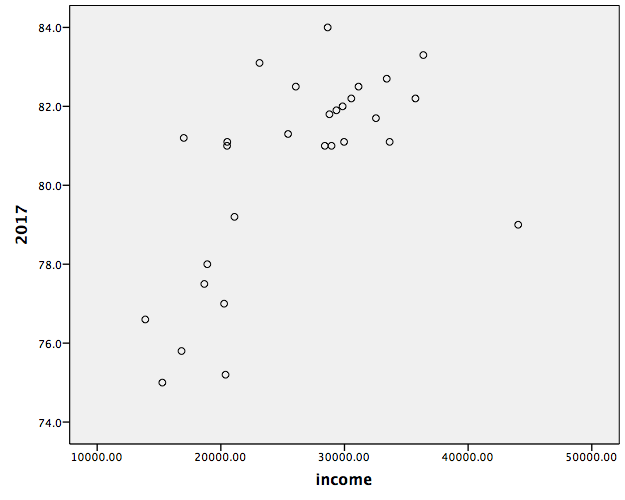
```


### Practice Problems

___


1. Create a histogram for life expectancy in the year 1800. Describe the distribution. How does it differ from the one we plotted for 2017?

2. Plot the life expectancy of each country in 1800 vs. that of 2018. What does this graph show you? What are your conclusions regarding the development of nations?


## JAMOVI


  


