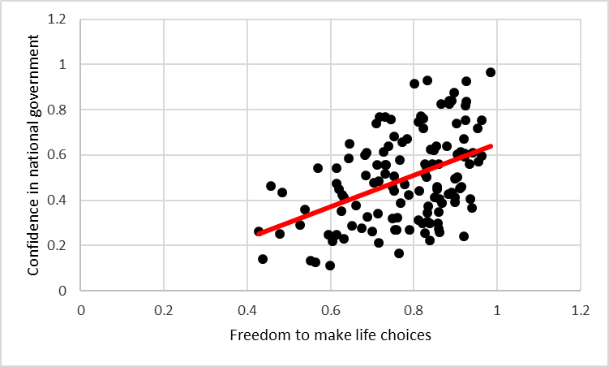

# Lab 3: Correlation

If ... we choose a group of social phenomena with no antecedent knowledge of the causation or absence of causation among them, then the calculation of correlation coefficients, total or partial, will not advance us a step toward evaluating the importance of the causes at work.
---Sir Ronald Fisher

In lecture and in the textbook, we have been discussing the idea of correlation. This is the idea that two things that we measure can be somehow related to one another. For example, your personal happiness, which we could try to measure say with a questionnaire, might be related to other things in your life that we could also measure, such as number of close friends, yearly salary, how much chocolate you have in your bedroom, or how many times you have said the word Nintendo in your life. Some of the relationships that we can measure are meaningful, and might reflect a causal relationship where one thing causes a change in another thing. Some of the relationships are spurious, and do not reflect a causal relationship.

In this lab you will learn how to compute correlations between two variables in software, and then ask some questions about the correlations that you observe.

## General Goals

1. Compute Pearson's r between two variables using software
2. Discuss the possible meaning of correlations that you observe

### Important Info

We use data from the [World Happiness Report](http://worldhappiness.report). A .csv of the data can be found here: <a href="https://raw.githubusercontent.com/CrumpLab/statisticsLab/master/data/WHR2018.csv" download>WHR2018.csv</a>

## Excel

Today we are going to take a look at some data collected as part of the World Happiness Report (WHR), and quantify some relationships within that data using both correlation (Pearson's r) and scatter plots. The World Happiness Report is a yearly report that is funded by the United Nations (and other organizations), that attempts to quantify the quality of life of people in different countries around the globe. By examining this data for patterns and relationships, we can gain insight into what political and cognitive factors make groups of people self-identify as being happy or not.

You can read more about the [WHR at their website](http://worldhappiness.report/).

### Goals

The analysis I am going to walk you through today is meant to answer the question:

>Was there a relationship between people's perceptions of their freedom to make choices about their own life, and their confidence in their national government in 2017? If so, what did this relationship look like?

We are going to answer this specific question by calculating and interpreting Pearson's r, and creating a scatter plot and best-fit line to visualize the relationship. 

After we go over how to answer this question, I will leave you with a few more questions about this data, to answer on your own, using the techniques you've learned in this lab.

### Load the data

1) Download the data as a .xls file from the [WHR](https://s3.ama zonaws.com/happiness-report/2018/WHR2018Chapter2OnlineData.xls).
2) Open the downloaded file in excel
3) Luckily, the data is already in .xls format, which is the standard Excel format, so we don't need to convert the data at all.
 
When you open the Excel file, you will see many rows and columns of data. It looks like a mess at this point, but the first thing we are going to do is clean it up, so that we are left with just the information we need to answer the question above. 

The first thing I want you to notice is that at the bottom of your worksheet, there is a horizontal gray bar, which contains several "tabs" that correspond to different worksheets of data contained in this file. The only one that we need for this lab is labeled "Table2.1", so let's delete the rest of them:

### Removing unnecessary worksheets

1) Right click on the first worksheet's tab you want to delete (lets go from left to right, so first right click "Figure 2.2")
2) Select "delete"" from the menu that appears
3) Repeat this process until all the worksheets other than "Table2.1" are gone. 

<iframe width="560" height="315" src="https://www.youtube.com/embed/bk-FushJW2k" frameborder="0" allow="autoplay; encrypted-media" allowfullscreen></iframe>

Now let's take a closer look at the "Table2.1" worksheet. 

#### Resizing columns for a cleaner display

Each row in this file represents a specific country, during a specific year. The first two columns tell us what country and year the rest of that row is referring to. You might notice that in the first row, there are labels that identify the information in each of the columns. These are called "variable names", or "headers" if you want to sound fancy. You might notice that some of the variable names are cut off, because that specific column is not wide enough to display the whole name. To fix this for your entire worksheet at once:

1) Press "ctrl+a", twice OR click the little sideway triangle between the "1" that labels row 1 and the "A" that labels column A (either of these methods will select ALL the data on the sheet for you. every row and every column)
2) Now double click the little line between the column A and B column labels

You should see that all of the columns have now changed width to be big enough to display their entire name. This is an odd trick, and much easier to understand in the video below. 

<iframe width="560" height="315" src="https://www.youtube.com/embed/D8WpP07G3hQ" frameborder="0" allow="autoplay; encrypted-media" allowfullscreen></iframe>

If you are interested in how each of these variables was measured / calculated, you can read about them [here.](https://s3.amazonaws.com/happiness-report/2018/Appendix1ofChapter2.pdf)

#### Create a working copy of the data

This study measured many dependent variables, but for now we will analyze only the "Freedom to make life choices" and "Confidence in national government" variables, found in columns G and L, respectively.   

It is a good practice to always keep an unedited copy of the raw data. Now that we have gotten rid of the other worksheets, let's make ourselves a fresh empty worksheet, and copy just the data we need on to it.

1) Click the "+" button on the worksheet tab bar to create a new worksheet
2) Right click on the new worksheets tab and select "rename""
3) Give the sheet a meaningful name, maybe "Freedom-Confidence 2017" 
4) Select the "Table2.1" worksheet 
5) Click the letter "A" column label to select all of column A
6) Press ctrl+c to copy (or right click the selected data and select copy)
7) Go to the worksheet we just created
8) Select cell A1
9) Press ctrl+v (or right click A1 and select "paste") to paste the "Country" variable into column A of our new worksheet.
10) Repeat steps 5-9, but now copy the "Year", "Freedom, and "Confidence" variables from Table2.1 columns B, G, and L, to columns B, C and D of our new worksheet. 

<iframe width="560" height="315" src="https://www.youtube.com/embed/AuWG9fT87LM" frameborder="0" allow="autoplay; encrypted-media" allowfullscreen></iframe>

Now we have a worksheet with only four variables, which should be much more pleasant on the eyes. However, we still have more data than we need. The question above asks specifically about these two variables *in 2017*, and we currently have the data from every year that was recorded in the overall data set. To remove the data from years we are not interested in:

#### Sort the data and remove unnecessary rows

1) Press ctrl+a, twice. (select all data)
2) Click the "data" tab in the menu ribbon
3) Click "sort" to open the sort dialogue
4) Sort by the "year" column. (Make sure "my data has headers" is checked, because your data has headers) 
5) Choose the "largest to smallest" order
6) Press "ok"
7) Left click and hold down the mouse button on the row number of the first row with data from 2016, and drag down until all of the non 2017 data is selected
8) Press the "delete" button (or right click the highlighted data and select delete)

<iframe width="560" height="315" src="https://www.youtube.com/embed/hI1i2pTGBJM" frameborder="0" allow="autoplay; encrypted-media" allowfullscreen></iframe>

WooHoo! Our data is all nice and organized and sorted. Now let's start the hard part! Calculating r and creating a scatter plot of these two variables.

### Calculate Pearson's r, and the coefficient of determination

1) Select a blank cell somewhere on the worksheet with the 2017 freedom and confidence data.
2) In that cell type "Pearson r" (This is a label to remind ourselves what we are calculating in that area)
3) In the cell directly below this label type:

>=CORREL(C2:C142,D2:D142)

4) Press enter.

And r is calculated! Jeez... It's just not fair, how much math we have to do in this class!

<iframe width="560" height="315" src="https://www.youtube.com/embed/u6SoRVjmBo0" frameborder="0" allow="autoplay; encrypted-media" allowfullscreen></iframe>

### Generate a scatter plot

1) Select the column containing the "Freedom" variable by clicking the letter at the top of its column. 
2) Hold the ctrl button, and select the column containing the "Confidence" variable (now both columns should be highlighted)
3) Click the "insert" button on the menu ribbon at the top of the screen
4) Click the scatter plot button (the image looks like a tiny little scatter plot)

<iframe width="560" height="315" src="https://www.youtube.com/embed/4GcAeuTdYkw" frameborder="0" allow="autoplay; encrypted-media" allowfullscreen></iframe>

And we have a scatter plot! 

Let's give it proper axis titles, and a descriptive plot title like "Relationship between self perceived of freedom of choice and confidence in the national government worldwide - 2017". I also hate color, so I played with the plot settings a bit, made it black and white, and simplified the look of it. 

Now, we will also add a best fit line, to highlight the linear trend in this data. 

#### Adding a best fit line to a scatter plot

1) Select your graph by left clicking it. (Sometimes if you already have a graph object selected, you first need to click out of the graph by clicking any empty cell)
2) Click the green "+" symbol that will appear to the left of your graph
3) Click the checkbox next to the "trendline" option.

This "best fit" or "trend line" is the line that comes as close as possible to each point in the data set. It's helpful for visually estimating how the y-axis variable changes relative to the x-axis variable. one can also visually estimate the r value of two variables, based on how close to this best fit line the points fall (If two variables share a correlation of 1, the data will all fall *on* the best fit line, because they share a perfect *linear* relationship) 

<iframe width="560" height="315" src="https://www.youtube.com/embed/l27369UufGA" frameborder="0" allow="autoplay; encrypted-media" allowfullscreen></iframe>

### Interpreting our results

We discovered a moderately strong positive correlation between peoples experience to freely make life choices, and their confidence in their national government, as measured across 140 different countries in 2017 (r(140)=.44)(Figure 1). This suggests that people across the world who are more confident in their government, also feel freer to make choices. It is possible that this is a causal effect (good government makes on feel free, or vice versa), but the correlational evidence presented here is not enough for us to draw that conclusion. It is also possible that other outside variables, such as economic or social forces, may be motivating this correlation. As always, there is a chance this correlation is spurious (due to chance), but this is unlikely in this case, due to the large size of our r value, and our large N. 
  

### On Your Own

1) Calculate and r value and create a scatter plot between the same variables we used here, but for the year 2014
2) Calculate an r value and create a scatter plot between a different pairs of variables in this data set, for only the 2017 data
3) In one to two pages, report and interpret you calculations and scatterplots

